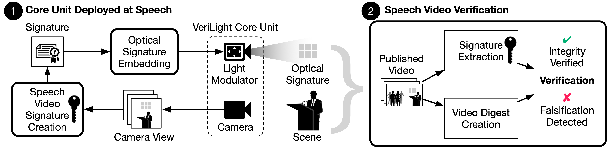

# Combating Falsification of Speech Videos with Live Optical Signatures
[](https://doi.org/10.5281/zenodo.17063746)

> **Artifact Overview** 
>
> This artifact contains all material needed to replicate VeriLight. The VeriLight core unit is built with specialized hardware that would not be available in most labs. Thus, we provide a [demo](#demo) with a screencast of the core unit operating at a speech, sample recordings from the event, and step-by-step instructions for verifying those recordings using provided code. The demo section is the focus of this artifact, but we hope our [instructions](resources/core_unit_guide.md) on replicating the hardware will also aid reproduceability.
>
> Please note that the video datasets used to produce our paper's results cannot be released for privacy and IRB reasons. The videos in this repo are a small set created separately, purely for demonstration purposes and to provide a basis for evaluating our claims on VeriLight's ability to detect falsifications.
>
> The expected time needed to evaluate the artifact is as follows:
> 1. [Requirements and Installation](#requirements-and-installation) (5 human-minutes and 10 compute-minutes)
> 2. [Run demo notebook](#demo) (10 human-minutes and 35 compute-minutes)


VeriLight is a system for protecting live speech videos from visual falsification of speaker identity and lip and facial motion. Unlike the predominant *digital* methods for detecting fake videos, VeriLight creates dynamic *physical* signatures at the speech site and embeds them into all video recordings via imperceptible modulated light. These physical signatures can be extracted from any video downstream and validated against the portrayed speech content to check its integrity. 

The system has two main components:
1) the core unit, a device deployed at the speech site to generate and embed physical signatures
2) the video verification software, which can be run on any speech video offline to verify its integrity

<div align="center">
    
</div>


## Repo Structure
This repo provides:
1.  All code and design files needed to replicate our system
2. [Guides](resources) on building and deploying a VeriLight core unit at a speech
3.  A [step-by-step demo](demo.ipynb) complete with sample videos to input to the verification software.

The repo is structured as follows:
- ```embedding```: Code for live signature generation and embedding 
- ```verification```: Code for offline verification of videos
- ```common```: Code and configuration files shared between signature generation/embedding and verification
- ```resources```: A guide and all necessary non-code-related resources for building and running a VeriLight core unit
- ```data```: Videos and reference output for the demo
- ```assets```: Images and videos used in README and guides

For our PyTorch implementation of MediaPipe FaceMesh (used to develop our adversarially-trained reenactment models) see [here](https://github.com/Hadleigh-Schwartz/pytorch_facemesh/tree/main).

## Requirements and Installation
This implementation has been successfully tested in macOS and Windows with Python 3.8.20. 

Follow the steps below to prepare to use VeriLight code:
1. Clone this repo 
    ```
    git clone ...
    cd ...
    ```
2. Clone the submodules
    ```
    git submodule init
    git submodule update
    ```
3. Ensure you have ```conda``` installed on your system. See [here](https://docs.conda.io/projects/conda/en/latest/user-guide/install/index.html) for conda installation instructions.
4. Create a conda environment for running VeriLight
    ```
    conda create -n verilight python=3.8.20
    ```
5. If you would like to generate videos visualizing the verification results (see [below](#verify-a-video), make sure you have ffmpeg installed.
   
     Linux:
       ```
       sudo apt-get update
       sudo apt-get install ffmpeg
       ```
   
      macOS:
      ```
      brew install ffmpeg
      ```
      
      Windows: Download ffmpeg binary [here](https://ffmpeg.org/download.html).
7. Install dependencies in the conda environment
    ```
    conda activate verilight
    pip install -r requirements.txt
    ```

## Build and deploy a VeriLight core unit

See [here](resources/core_unit_guide.md) for a guide on building a core unit and instructions on operating it at a speech.

## Verify a video
Video verification is centeralized in the [```verify.py```](verify.py) script.

**Basic usage:**
```
python verify.py video_path output_path [ options ]

positional arguments:
  video_path            Path to the video to verify
  output_path           Path to save the output files

options:
  --force_recalculate_homography, -frh
                        Force recalculation of homography even if it already exists in the output folder
  --force_repredict_interwin, -fri
                        Force recalculation of interwindow boundaries even if they already exist in the output
                        folder
  --force_rerecover_digests, -frd
                        Force recalculation of digests even if they already exist in the output folder
  --force_reverify, -frv
                        Force re-verification even if final results already exist in the output folder
  --visualization, -vis
                        Generate video visualizing the verification process and results
```

The script prints a verification decision and summary (See the [Demo](demo.ipynb) for examples). It also saves variables produced by each stage of the verification process (localization/homography, window boundary detection, recovering digests from the embedded signature, comparing video against digests, etc.) in the output folder. By default, these variables will be re-loaded if they already exist in the output folder, to support quick inspection intermediate results. Use the command line options to override this behavior.

**Advanced usage:**

For more control over the verification and visualization parameters, refer to ```verify()``` in [```verify.py```](verify.py) and ```visualize_ver_results()``` in [```visualization.py```](verification/visualization.py)

## Demo
A demo is provided as a Jupyter notebook [here](demo.ipynb). See [here](https://docs.jupyter.org/en/latest/) for instructions on running Jupyter notebooks or install the Jupyter notebook extension in your favorite code editor (e.g., [VS Code](https://marketplace.visualstudio.com/items?itemName=ms-toolsai.jupyter)). When starting the notebook, ensure you select the ```verilight``` kernel, corresponding to the conda environment created in [Requirements and Installation](#requirements-and-installation).

Before starting, download the videos/reference output [here](https://drive.google.com/file/d/1YfkcEZ0WHKrBfaAkWabI15o2LLmZAYUo/view?usp=sharing) and place the contents in the ```data``` directory.

## Copyright
© 2025 The Trustees of Columbia University in the City of New York.  
This work may be reproduced, distributed, and otherwise exploited for academic non-commercial purposes only. To obtain a license to use this work for commercial purposes, please contact Columbia Technology Ventures at techventures@columbia.edu.
