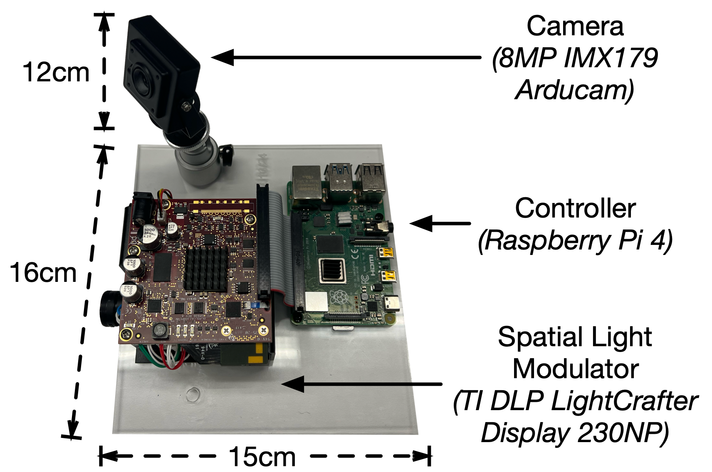

© 2025 The Trustees of Columbia University in the City of New York.  
This work may be reproduced, distributed, and otherwise exploited for academic non-commercial purposes only.  
To obtain a license to use this work for commercial purposes, 
please contact Columbia Technology Ventures at techventures@columbia.edu.

# Building a core unit

The original VeriLight prototype uses a Texas Instruments SLM, a Raspberry Pi as an interface to the SLM, and a PC (Macbook) as the central processor running digest extraction, building bitmaps for display, and sending those to the SLM Raspberry Pi via a socket.

This guide is specific to these components, though the framework is theoretically compatible with alternatives (e.g., different microprocessors or SLM models).

## Parts
- [Raspberry Pi 4B](https://www.amazon.com/Raspberry-Pi-RPI4-MODBP-4GB-Model-4GB/dp/B09TTNF8BT?tag=googhydr-20&source=dsa&hvcampaign=electronics&gbraid=0AAAAA-b0EosazeVwcGR7W9PfISTaVP6m3&gclid=CjwKCAjw5PK_BhBBEiwAL7GTPQVOYkEATCAGZLEQKGejSL8wZ14tbyIgVWfgBJjCokSiEwoTJYMl3hoC9D8QAvD_BwE) + SD card as described in manual
- [DLPDLCR230NPEVM](https://www.ti.com/tool/DLPDLCR230NPEVM#tech-docs) SLM + power supply as described in manual
- Any UVC-compatible USB RGB camera. We use [this](https://www.arducam.com/product/8mp-imx179-autofocus-usb-camera-module-with-waterproof-protection-case-for-windows-linux-android-and-mac-os/) Arducam
- A PC capable of establishing an SSH connection with the RaspberryPi

The physical assembly of these parts is mostly up to the user. The only requirement is that the USB camera should be fixed relative to the SLM after calibration. You can achieve this however you want. We laser print a base to hold the SLM, Raspberry Pi, and Arducam steady. For interested users, we provide the base's design as both a [.beam file](raspi_and_evm230NP_base.beam) (for use with Beamo laser cutters) and [an SVG](raspi_and_evm230NP_base.svg).

The camera should be connected to the PC, while the SLM is connected to the Raspberry Pi.

<div align="center">
    
</div>


## One-time setup

### Hardware
1. Use [Raspberry Pi Imager](https://projects.raspberrypi.org/en/projects/raspberry-pi-setting-up/2) to flash an SD card with a legacy 64-bit version*. Edit the configuration settings to set username and password and enable SSH, so that you can SSH with Pi in headless mode from even the first boot. 
2. Eject the SD card and plug it back in to computer. It should show up as a device named 'bootfs'. Replace config.txt on this device with the config.txt file provided in [dlpdlcr230np_python_support_code](dlpdlcr230np_python_support_code). Note: Modifying config.txt from the Pi after booting up did NOT work. Only modifying it on the SD card as mentioned above did. 
3. Put SD card in Raspberry Pi.
4. Connect DLP230NP EVM to Raspberry Pi via provided FPC cable.
5. Connect Pi to personal computer via Ethernet cable. The Pi should be accessible at raspberrypi.local by default.

\* Otherwise, I only see a black screen. Similarly reported (and resolved) [here](https://e2e.ti.com/support/dlp-products-group/dlp/f/dlp-products-forum/1288278/dlpdlcr230npevm-init_parallel_mode-displays-black-screen). I have validated with Raspbian 11 (bullseye) 64-bit.

### Software
#### On your PC 
Note: These instructions have only been tested on MacOS.
1. Ensure you've installed the submodules and dependencies as described in the README.
2.  Enter the uvc-util submodule (in the [embedding folder](../embedding/)) and build the uvc-util tool as described in the README. Note: you will need xcode to do this. The VeriLight code expects a binary named uvc-util at the top level of the uvc-util folder.
<!-- 3. Download the UltraLightFace detector labels and checkpoint and place them in the [Ultra-Light-Fast-Generic-Face-Detector-1MB](../common/Ultra-Light-Fast-Generic-Face-Detector-1MB/) folder. Note: included in submodule-->
3. Optionally enable SSH/SCP to the RaspberryPi from your PC without a password. Assuming there is already a keypair in ~/.ssh, just run `ssh-copy-id <user>@<host>` (e.g., `ssh-copy-id verilight@raspberrypi.local`)

#### On the Raspberry Pi
1. SSH into the RaspberryPi from your PC.
2. [Install conda](https://github.com/conda-forge/miniforge#download)
3. Create a conda environment with Python 3.8 for running the code. Activate it and install the following necessary packages:
    ```
    pip install opencv-python
    pip install colorama
    pip install numbers_parser
    ```
Note that this is a different conda environment than the one provided for your Mac, and is already located on the Raspberry Pi.
4. Install xterm: `sudo apt install xterm`
5. Copy the entire [dlpdlcr230np_python_support_code](dlpdlcr230np_python_support_code) directory to the home directory of the Raspberry Pi.
6. Copy the following files to the home directory of the Raspberry Pi:
- [light_server.py](../embedding/light_server.py)
- [calibration_light_server.py](../embedding/calibration_light_server.py)
- [pi_display_utils.py](../embedding/pi_display_utils.py) 
- [embedding_utils.py](../embedding/embedding_utils.py)
- [psk_encode_minimal.py](../embedding/psk_encode_minimal.py)
- [black.png](../embedding/black.png) 
- [shutdown.sh](shutdown.sh)
7. Add following lines to  *~/.bashrc* on Pi:
    ```
    echo -e '\e]11;rgb:00/00/00\a'sud
    echo -e '\e]10;rgb:00/00/00\a'
    ```
    These make background and text of terminal black, which is necessary for our encoding. Otherwise, the terminal will appear in between BMP displays.
8. Disable screen blanking via raspi-config.
   "Display Options" > "Screen Blanking" and select "No" to disable the feature


## Sanity check your work
Make sure you can operate the SLM to project things. Either of the below methods will work.

### Try using as Desktop mirror
1. Enter the [dlpdlcr230np_python_support_code](dlpdlcr230np_python_support_code) on the Pi. Run `python3 init_parallel_mode.py`. Your Pi Desktop should now be projected.

### Try projecting a video in full-screen mode
1. Disable desktop display on the Pi by running `sudo systemctl stop lightdm.service`. (Based on [this](https://www.makeuseof.com/how-to-disable-lightdm-linux/#:~:text=To%20disable%20LightDM%2C%20all%20you,if%20you're%20using%20runit.)) article. Note it is important to run this before next step.
2. Enter [dlpdlcr230np_python_support_code](dlpdlcr230np_python_support_code) on the Pi. Run `python3 init_parallel_mode.py`.
3. In one terminal, run `sudo xinit `. CAUTION: Do not run this before running init_parallel_mode.py. This appears to cause xinit to crash soon after starting, with the only fix being a reboot. 
4. In other terminal, `export DISPLAY=:0`. Now you can view a video using vlc, opencv, etc. 
5. To shut down, first run shutdown.sh on Pi, WAIT until green indicator light on Pi is off, then unplug Pi, then unplug DLP230NP EVM.


# Deploying a core unit at a speech

## Preparation
### Connections and power
1. Plug the power jack into the SLM.
2. When you see the SLM has projected the striped splash screen, plug the USB-C power cord into the Raspberry Pi.
3. Plug in the core unit camera's USB to your computer.
<!-- 4. Plug in the other end of the Ethernet cord to your computer.  -->

### Software
Raspberry Pi: 
1. Open a separate terminal and SSH into the Raspberry Pi.
2. Make sure the Raspberry Pi is connected to WiFi. This is a very important step because the embedding code requires global timestamps to synchronize between the Rasperry Pi and controlling computer. To check if connected to WiFi, run `ping 8.8.8.8`. If it outputs `64 bytes received...` it is connected. In the case it is not, run the command
`sudo raspi-config` on the Pi, and then use the GUI to connect to WiFi. 
3. Disable desktop display on the Pi by running `sudo systemctl stop lightdm.service`. (Based on [this](https://www.makeuseof.com/how-to-disable-lightdm-linux/#:~:text=To%20disable%20LightDM%2C%20all%20you,if%20you're%20using%20runit.)) article. Note it is important to run this before next step.
4. Enter the directory dlpdldcr230npevm_python_support_software_1.0 on the Pi and run `python3 init_parallel_mode.py`.
5. Activate the Pi-specific conda environment (see [getting_started.md](getting_started.md) if you haven't already created this environment). 

Your computer:
1. Open two terminals for running code locally. Enter the [embedding](../embedding) directory on each terminal, as all scripts you will later need to run locally are located here. 
2. Activate the provided conda environment (created from [df_mac.yml](df_mac.yml)) in each.

### Config file
All parameters for the embedding and verification stages are specified in a [config](../common/config.py) file. The provided config file contains the parameters used for our prototype and experiments. Due to the complexity of the system, the parameters are extensive and we do not recommend changing them without first reading through their affected functionality in the code. For further questions, contact the authors or submit a Github issue.

## Deploy
You will need three terminals open: the first SSH'd into the Raspberry Pi, and the second two for running scripts locally on your computer, which should be ready to go from the Environment Prep section. 

### Calibration
1. In your Raspberry Pi terminal, start the position calibration light server by running `python calibration_light_server.py`
2. In your first local terminal, start the position calibration code by running `python calibration.py`.
The first thing that it will do is display the core unit camera's video feed and ask you to verify that it looks ok in terms of color quality and focus. If it looks ok, click in the camera display and then press the "a" key. If the color or focus are look off (which may happens the first time that you run the calibration or deployment code for the first time after plugging in the core unit camera), keep the view open and follow the instructions below to adjust the settings. When they look ok, click in the camera display and then press the "s" key to save these settings to ensure they are used in future runs. 
3. Once you click accept, the calibration process will start. The idea of calibration is for the system to learn where on the projection surface it should look for each specific cell. To do this, the SLM will project a calibration sequence, consisting of four red cells - one in each corner - blinking repeatedly. Once it's done projecting this sequence, your local computer will start processing the video from the core unit camera and eventually pop up several display windows to guide you through the process of accepting the calibration settings. First, it will show you its "Inferred calibration corners." The terminal prompt wil ask you if you would like to accept this output ("Are the inferred calibration corners ok? y/n"). If the calibration went well, you should see four very bright squares, corresponding to the blinking calibration corners, and a black background. The squares should be labeled - from top to bottom, left to right: 1, 2, 3, 4. If you see this, enter "y" in the terminal prompt. Otherwise, enter "n" and then one by one, from top to bottom, left to right, click the centers of the correct corners. When you are done, click in the display and enter "q". 

The calibration will now perform the homography (mapping from core unit camera view to reference SLM view). It will display the source (a SLM calibration BMP template), destination (the produced heatmap), and result (heatmap warped so that the calibration corners in it match the calibration corners in the template). If the homography was successfully, you will see that the warped heatmap (result) corners match up very closely with the template corners. Press "q" on your computer to close each of these three displays. Once they are all closed, the system calibration.py will create (if this is your first time running calibration) or update the file [embedding/curr_hom.pkl](embedding/curr_hom.pkl) and then terminate. If the homography looked successfull and you see that curr_hom_pkl has been updated, you are good to go! 

Once you have run the calibration, you cannot move the camera! Even a small change in its position or angle relative to the projection surface can cause embedding adaptation to fail to function properly.

Here is a video showing the calibration process:
<div align="center">
    <video src="https://github.com/user-attachments/assets/ee2cc782-f7e1-4833-bf4a-fcbf6e933813">
</div>


### Deployment
The real-time embedding system consists of three main components, distributed across three scripts. 
(1) [embedding_driver.py](../embedding/embedding_driver.py) runs on the computer, accepting new digests produced by (2) [signature_generation.py](../embedding/signature_generation.py) and making them into bitmaps for the SLM to display, and also coordinating adaptive embedding. (3) [light_server.py](../embedding/light_server.py) is run on the Raspberry Pi and accepts new bitmap sequences for the SLM to display. From your setup, it should be located in the home directory of the Rasperry Pi. 

1. In your Raspberry Pi terminal, start the light server by running `python light_server.py`.
2. In your second local terminal, start the digest extraction process by running `python signature_generation.py`. It will set up the face detection and MediaPipe extractor and then hang waiting for indication from the embedding_driver.py that it should start. Let it hang while you start embedding_driver.py below.
3. In your first local terminal, start the embedding_driver by running `python embedding_driver.py`. The first thing it will do is copy the config file to the Raspberry Pi to ensure that all code running on each machine is using the same embedding parameters. Then, it will display the core unit camera's video feed. Using the same procedure described in the Calibration section, accept or update+save the camera settings. 

Start all the data collection recording devices, and then enter "y" in the embedding_driver terminal's prompt.
After a few seconds, you will see the SLM indicate that is has received a window's sequence of bitmaps. Shortly after it will begin to (visibly) display them.
The first few windows (each a few seconds long) will be visible, and then eventually adaptation will kick in and the code will become imperceptible.

Here is a video showing the deployment process:
<div align="center">
    <video src="https://github.com/user-attachments/assets/ab599a9d-6c8c-4776-9f9a-69db9199a766">
</div>


### Adjusting core unit camera settings
The core unit camera settings must be manually adjusted. We use the uvc-util tool for this (Mac only). For example, with the Arducam used by our prototype:
- To turn off auto-focus: 
```
./embedding/uvc-util/uvc-util -I 0 -s auto-focus=False
```
- To manually focus:
```
./embedding/uvc-util/uvc-util -I 0 -s focus-abs=<x>
```
where x is a value between 30 and 100 that makes the camera view seem the most focused. You can experiment with different values until it seems in focus.
- To turn off auto white balance: 
```
./embedding/uvc-util/uvc-util -I 0 -s auto-white-balance-temp=True

./embedding/uvc-util/uvc-util -I 0 -s auto-white-balance-temp=False
```

## Shutdown
1. Run `sh shutdown.sh` on the Pi. WAIT until green indicator light on Pi is off.
2. Unplug the Pi and then the SLM.
2. Unplug everything else however you'd like. 

